# 🚀 Docker Tabanlı AI Meeting Assistant (Yapay Zeka Toplantı ve Karar Destek Platformu)


Bu proje; **Docker**, **Docker Compose**, **Node.js/Express**, **Ollama (Llama 3.2)**, **n8n** ve **PostgreSQL** teknolojilerini kullanarak kurum içi toplantı notlarını analiz eden, görev ve riskleri tespit eden, kurumsal raporlar üreten yerel bir **Yapay Zeka Toplantı Asistanı ve Karar Destek Platformudur**.

---

## 🎯 Projenin Amacı ve Öne Çıkan Özellikler

Toplantı notlarının tek bir merkezden işlenerek otomatik olarak aşağıdaki çıktıların üretilmesi, veritabanında saklanması ve kurumsal formatlarda dışa aktarılması hedeflenmektedir:

- 📌 **Toplantı Özeti:** Toplantının ana konusu, genel akışı ve alınan kritik kararlar.
- 📋 **Görev Analizi (Task Extractor):** Yapılacak işler, sorumlular, teslim tarihleri ve durum takibi (Yapılacak / Yapılıyor / Tamamlandı).
- ⚠️ **Risk Analizi (Risk Analyzer):** Projedeki olası darboğazlar, etki seviyeleri (Yüksek / Orta / Düşük) ve önlem planları.
- 👔 **Yönetici Özeti (Executive Brief):** Üst düzey yöneticilere özel 2 cümlelik özet, alınan kararlar ve onay gereken konular.
- 📄 **Kurumsal Rapor Dışa Aktarma (Export Engine):** Analiz sonuçlarını **PDF** (Kurumsal Antetli & Yazdırılabilir), **Word (.docx)** veya **Markdown (.md)** formatlarında tek tıkla indirme.
- 🔍 **Canlı Arama ve Kategori Filtreleme:** Geçmiş toplantılarda anlık kelime araması ve kategorilere göre filtreleme (*Yazılım*, *Pazarlama*, *Siber Güvenlik*, *Yönetim*, *İnsan Kaynakları*, *Bütçe*).
- ☀️ **Koyu / Aydınlık Tema (Light & Dark Mode):** Kullanıcı tercihine göre anında tema değişimi.
- 💬 **Çoklu Sohbet Oturumu (ChatGPT Style AI Chat):** Toplantı notları ve kararlar üzerinde soru sorabileceğiniz bağımsız sohbet oturumları.
- 📧 **n8n Otomasyonu ve E-posta Bildirimi:** Analiz sonuçlarının istenen alıcılara e-posta bildirimi olarak gönderilmesi.

---

## 🛠️ Mimari ve Kullanılan Teknolojiler

```text
[ Custom Web UI & Express Gateway (Port 3000) ]  ───►  [ Ollama LLM (Port 11434) ]
                                                                     ▲
                                                                     │ API Connection
[ n8n Workflow Engine (Port 5678) ] ─────────────────────────────────┼─────────────► [ PostgreSQL DB (Port 5432) ]
                                                                                            ▲
[ pgAdmin Management UI (Port 5050) ] ──────────────────────────────────────────────────────┘
```

| Servis | Port | Açıklama |
| :--- | :---: | :--- |
| **Web UI & Express App** | `http://localhost:3000` | Kullanıcı dostu toplantı asistanı web arayüzü ve API gateway |
| **n8n** | `http://localhost:5678` | Otomatik iş akışları ve Webhook entegrasyonu |
| **pgAdmin** | `http://localhost:5050` | PostgreSQL veritabanı yönetim paneli |
| **Ollama** | `http://localhost:11434` | Yerel LLM servisi (`llama3.2` vb.) |
| **PostgreSQL** | `localhost:5432` | İlişkisel veritabanı (`meeting_db`) |

---

## 📂 Dizin Yapısı

```text
.
├── docker-compose.yml       # Konteyner orkestrasyon dosyası
├── README.md                # Proje dokümantasyonu
├── .gitignore               # Git yoksayma kuralları
├── ornek_toplanti_notlari.txt # Hızlı test ve demo için örnek not dosyası
├── app/                     # Web Arayüzü ve Backend Uygulaması (Node.js/Express)
│   ├── Dockerfile           # Node.js Docker imaj yapılandırması
│   ├── .dockerignore        # Docker yoksayma kuralları
│   ├── package.json         # Bağımlılıklar (Express, Pg, Cors, Dotenv)
│   ├── server.js            # Express API Gateway ve Veritabanı Servisleri
│   └── public/              # Frontend Arayüzü (HTML, CSS, JS)
│       ├── app.js           # Dinamik istemci mantığı, arama & dışa aktarma
│       ├── index.html       # Kullanıcı arayüzü
│       └── styles.css       # Tasarım sistemi ve Light/Dark tema CSS
├── database/
│   └── init.sql             # PostgreSQL başlangıç şema scripti (Tablolar & İndeksler)
├── prompts/                 # AI Agent Sistem Prompt'ları
│   ├── 01_meeting_summarizer.md
│   ├── 02_task_extractor.md
│   ├── 03_risk_analyzer.md
│   └── 04_manager_assistant.md
├── workflows/               # n8n İş Akışı şablonları
│   └── meeting_assistant_workflow.json
└── screenshots/             # Uygulama ekran görüntüleri
```

---

## 📸 Ekran Görüntüleri

### Toplantı Analizi Sayfası
| Koyu Tema | Açık Tema |
|:---------:|:---------:|
| 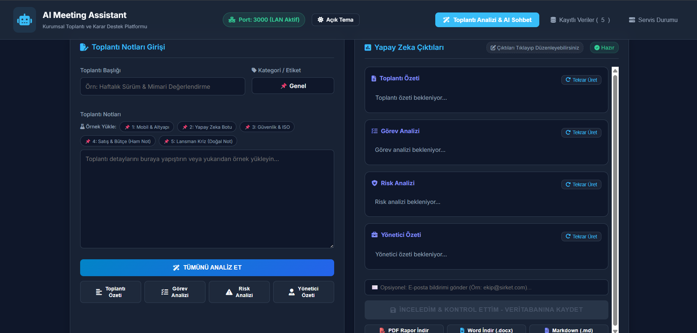 | 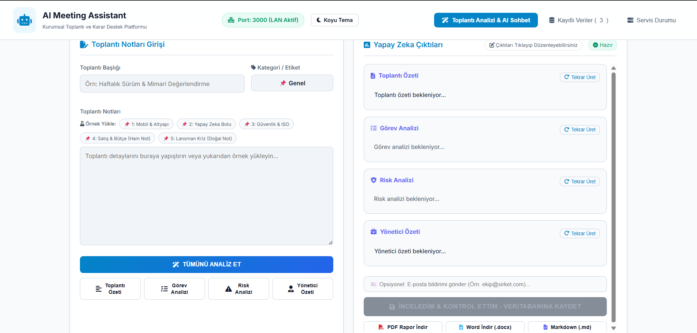 |

### Yapay Zeka Analiz Çıktısı (Toplantı Özeti)
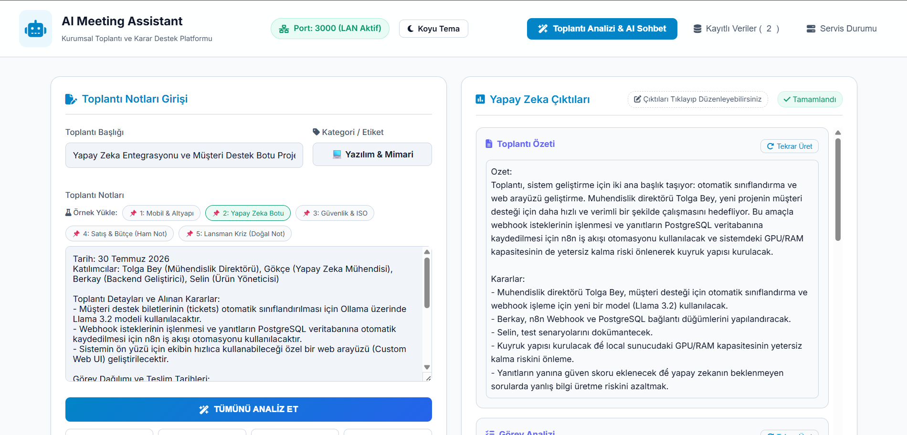

### Kayıtlı Toplantı Verileri
| Koyu Tema | Açık Tema |
|:---------:|:---------:|
| 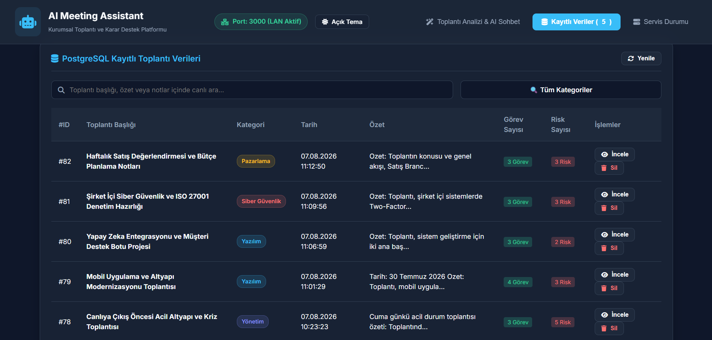 | 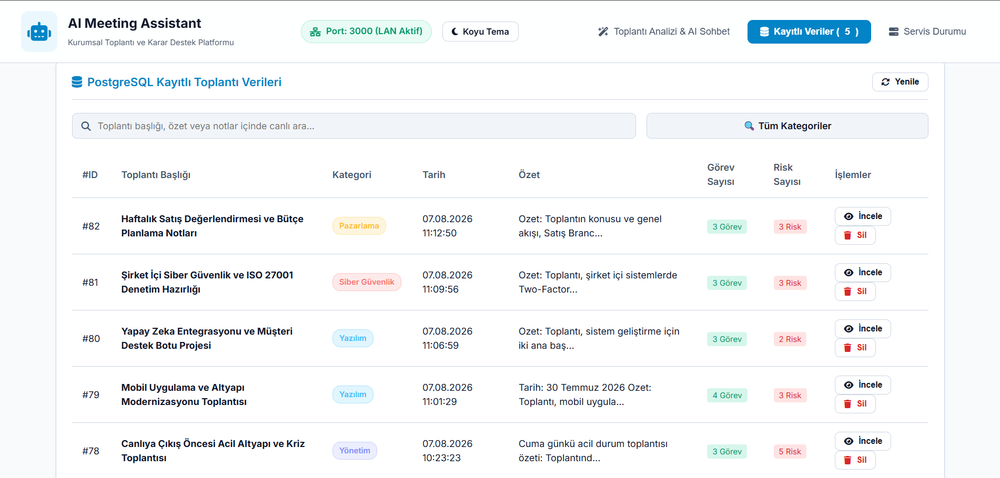 |

### Rapor Detayı ve Dışa Aktarma (PDF / Word / Markdown)
| Dışa Aktarma Modal | PDF Rapor Önizleme |
|:-------------------:|:------------------:|
| 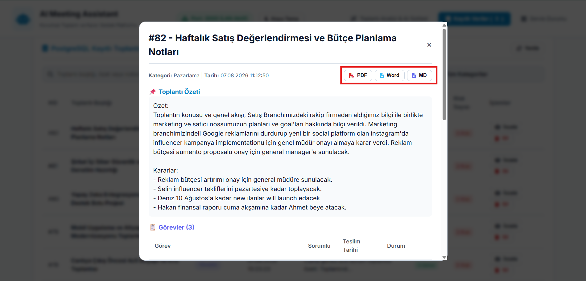 | 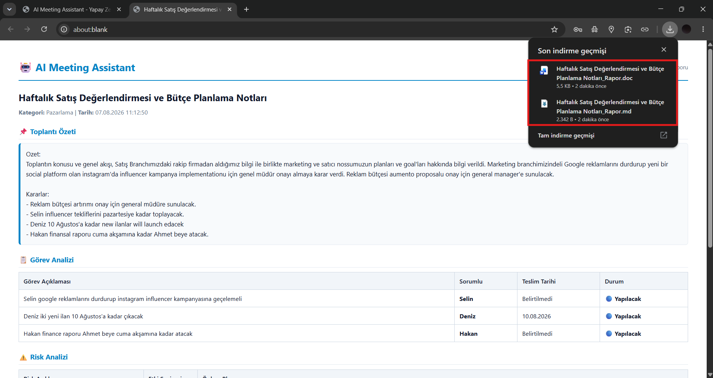 |

### Yapay Zeka Sohbet (ChatGPT Tarzı)
| Toplantı Hakkında Soru-Cevap | Koyu Tema |
|:-----------------------------:|:---------:|
| 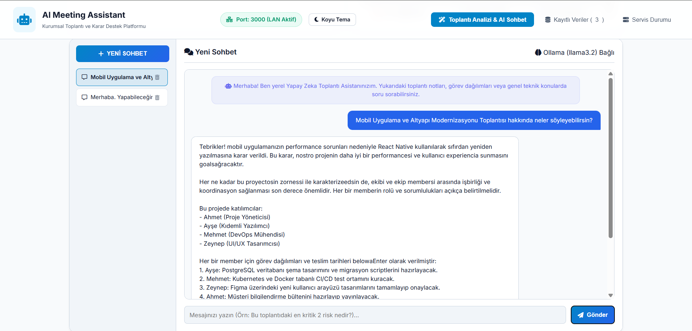 | 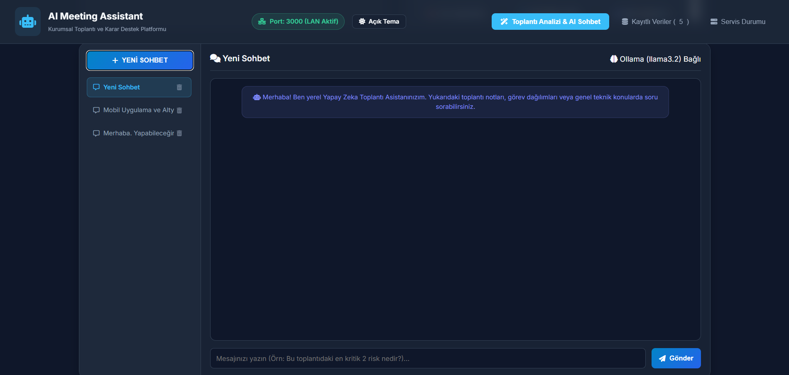 |

### Altyapı: n8n Workflow, Docker & PostgreSQL
| n8n İş Akışı (Analiz + E-posta) | Docker Konteynerler | pgAdmin Veritabanı |
|:--------------------------------:|:-------------------:|:------------------:|
| 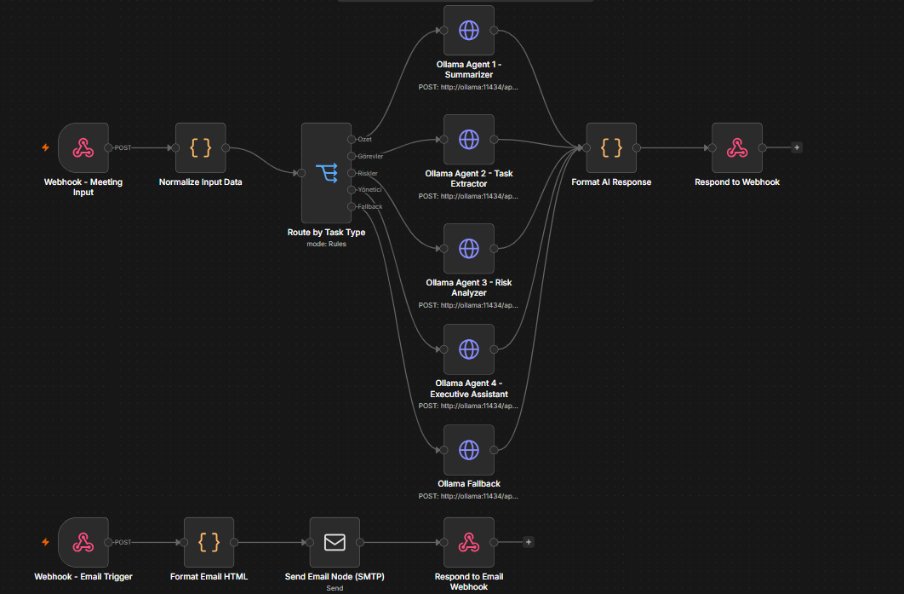 | 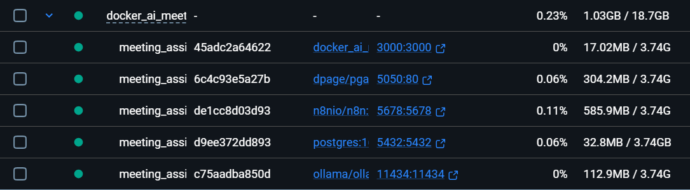 | 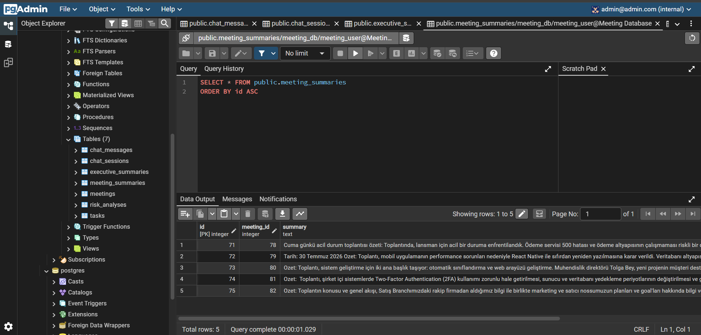 |

---

## 🚀 Hızlı Başlangıç (Kurulum Rehberi)


### Ön Gereksinimler
- Bilgisayarınızda **Docker** ve **Docker Desktop** kurulu ve çalışır durumda olmalıdır.
- Terminal veya Komut İstemcisi erişimi.

---

### 1. Adım: Projeyi Klonlayın

```bash
git clone https://github.com/mmehmetgokce/Docker-AI-Meeting-Assistant.git
cd Docker-AI-Meeting-Assistant
```

---

### 2. Adım: Servisleri Çalıştırın

Tüm servisleri (Web App, PostgreSQL, pgAdmin, Ollama, n8n) arka planda başlatmak için:

```bash
docker compose up -d
```

Servislerin durumunu kontrol etmek için:

```bash
docker compose ps
```

---

### 3. Adım: Yapay Zeka Modelini (Ollama) İndirin

Ollama servisine Türkçe/İngilizce performansı yüksek ve hafif olan `llama3.2` modelini indirin:

```bash
docker exec -it meeting_assistant_ollama ollama pull llama3.2
```

*(Opsiyonel)* Alternatif modeller eklemek isterseniz:
```bash
docker exec -it meeting_assistant_ollama ollama pull qwen2.5
```

---

### 4. Adım: Web Arayüzüne Erişin

Tarayıcınızdan aşağıdaki adrese gidin:
👉 **`http://localhost:3000`**

- **Toplantı Notları Girişi:** Başlık yazın, kategoriyi seçin ve notlarınızı girin.
- **Tümünü Analiz Et:** Tek tıkla özet, görevler, riskler ve yönetici özetini üretin.
- **Düzenle ve Kaydet:** Üretilen metinleri tıklayarak düzenleyebilir, veritabanına kaydedebilirsiniz.
- **Rapor İndir:** PDF, Word (.docx) veya Markdown (.md) olarak dışa aktarabilirsiniz.

---

### 5. Adım: n8n İş Akışını İçeri Aktarın (Opsiyonel)

1. Tarayıcıdan `http://localhost:5678` adresine gidin.
2. **Workflows -> Import from File** seçeneğini tıklayın.
3. Projedeki `workflows/meeting_assistant_workflow.json` dosyasını içeri aktarın.
4. **PostgreSQL Credentials** ayarlarında veritabanı bağlantı bilgilerini girin:
   - **Host:** `postgres`
   - **Database:** `meeting_db`
   - **User:** `meeting_user`
   - **Password:** `meeting_password`
   - **Port:** `5432`

---

### 6. Adım: pgAdmin Veritabanı Yönetimi

- **Arayüz:** `http://localhost:5050`
- **Giriş Bilgileri:** `admin@admin.com` / `admin`
- **Sunucu Ekleme (Add Server):**
  - **Host Name:** `postgres`
  - **Port:** `5432`
  - **Maintenance DB:** `meeting_db`
  - **Username:** `meeting_user`
  - **Password:** `meeting_password`

---

## 🧪 Test Etme ve Hızlı Demo

Sistemi hızlıca test etmek için iki yöntem kullanabilirsiniz:
1. **Arayüzdeki Örnek Yükleyiciler:** Web arayüzünde *"Örnek Yükle"* butonlarına (📌 1: Mobil & Altyapı, 📌 2: Yapay Zeka Botu vb.) tıklayarak hazır senaryoları yükleyebilirsiniz.
2. **Örnek Not Dosyası:** Proje dizininde yer alan `ornek_toplanti_notlari.txt` dosyasındaki metinleri kopyalayıp arayüze yapıştırabilirsiniz.

---

## 📊 Veritabanı Tablo Yapısı

`database/init.sql` scripti ilk kurulumda otomatik çalışarak aşağıdaki tabloları ve performans indekslerini oluşturur:

- `meetings`: Ham toplantı başlığı, kategorisi ve notları.
- `meeting_summaries`: Üretilen özetler ve alınan kararlar.
- `tasks`: Görev tanımı, sorumlusu, teslim tarihi ve durumu.
- `risk_analyses`: Olası riskler, etki seviyeleri ve önlem planları.
- `executive_summaries`: Yöneticiler için hazırlanan üst düzey raporlar.
- `chat_sessions` & `chat_messages`: Çoklu AI sohbet geçmişi ve mesajları.

---

## 👤 Geliştirici

**Mehmet Gökçe**  
GitHub: [@mmehmetgokce](https://github.com/mmehmetgokce)

---

> **💡 Port Çakışması Hakkında Not:**  
> Bilgisayarınızda `3000`, `5432`, `5678` veya `5050` portlarından biri başka bir uygulama tarafından kullanılıyorsa, `docker-compose.yml` dosyasındaki sol tarafta yer alan host portunu (örneğin `"8080:3000"`) değiştirerek çakışmayı anında çözebilirsiniz.
